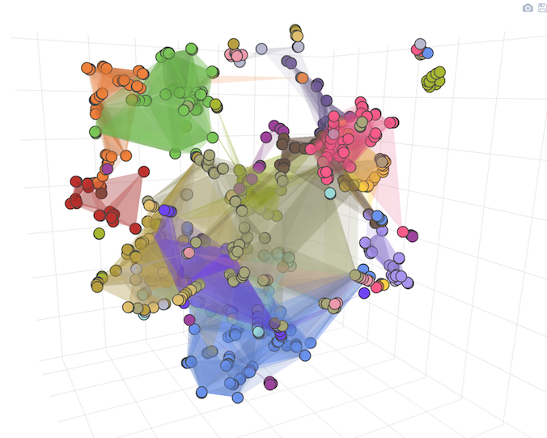

# Plotting Pokémon in 3D
Code + Visualizations processing and visualizing Pokémon data in 3D.

To view the full-screen standalone Pokémon 3D charts, [download the full repository](https://github.com/minimaxir/pokemon-3d/archive/master.zip) as a ZIP, then open the corresponding chart.

`pokemon-3d-standalone.html` corresponds to the version present in the blog post, but `pokemon-3d-standalone-cluster.html` contains 3D meshes for each cluster, as shown in the picture above. (the version with the meshes was not used for the blog post since it has poor performance and usability)

## Maintainer

* Max Woolf ([@minimaxir](http://minimaxir.com))

## License

MIT

If you do find this these visualizations useful, a link back to this repository would be appreciated. Thanks!

